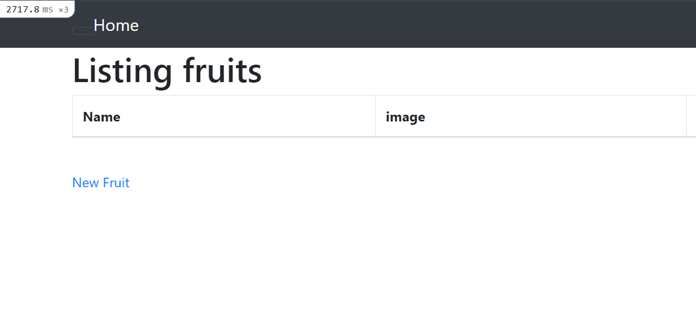
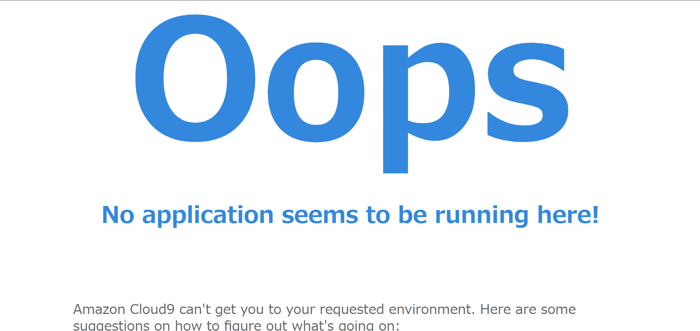
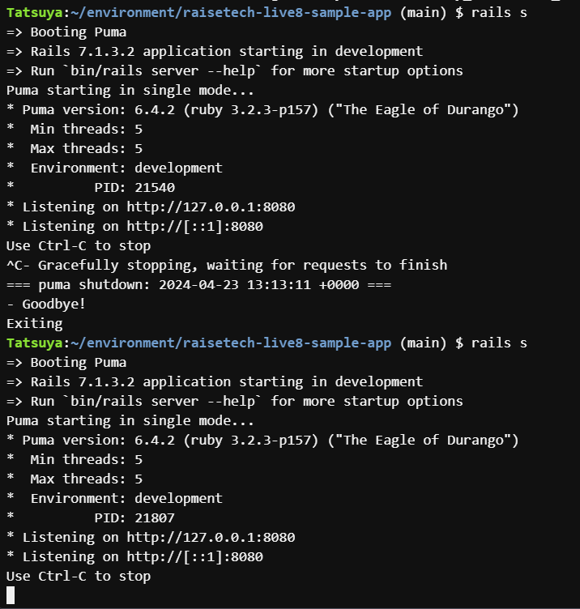
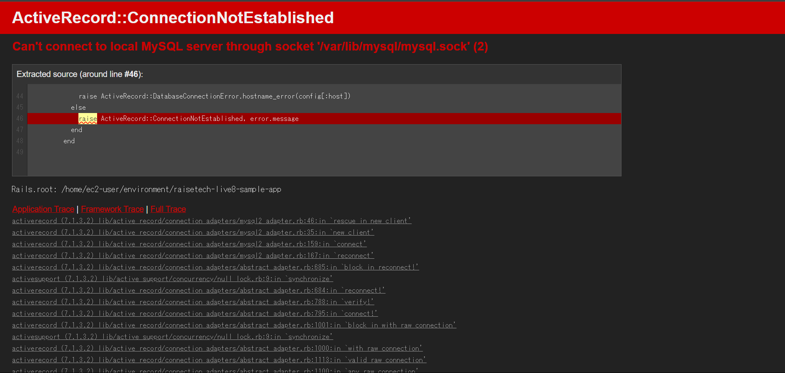
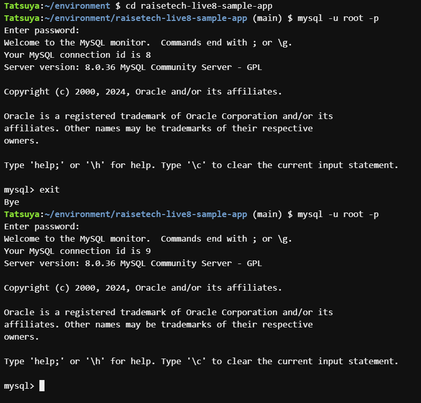

# 第3回課題

1. サンプルアプリケーションの起動
　　

2. APサーバーについて
    * APサーバーの名前：PUMA
    * バージョン：6.4.2
    * APサーバーを停止したとき：アプリは起動できない
    * 
    * APサーバーの再起動成功
    * 

3. DBサーバーについて
    * DBサーバーの名前：MySQL
    * バージョン：8.0.36
    * DBサーバーを停止したとき：アプリは起動できない
    * 
    * DBサーバーの再起動成功
    * 
    * Railsの構成管理ツール：Bundler

## 第3回課題から学んだこと
* rubyやnodeなどのバージョンをしっかり確認しないと正しくサンプルが起動しないのでバージョンを確認するのを忘れない
* rubyのモジュールをgemと呼び、Bundlerという構成管理ツールで必要なライブラリと適切なバージョンをインストールできる
* アプリケーションサーバーとは、アプリを実行するためのサーバーであり、railsの組み込みサーバーがPumaである