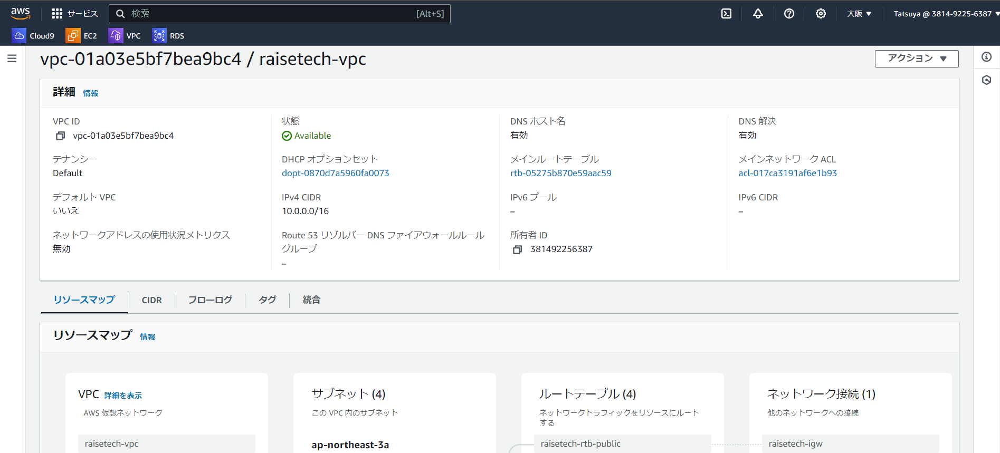
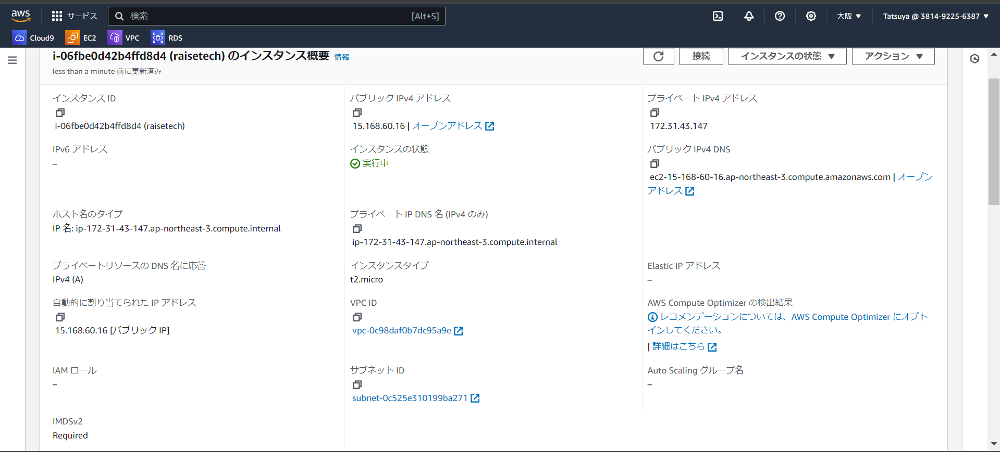
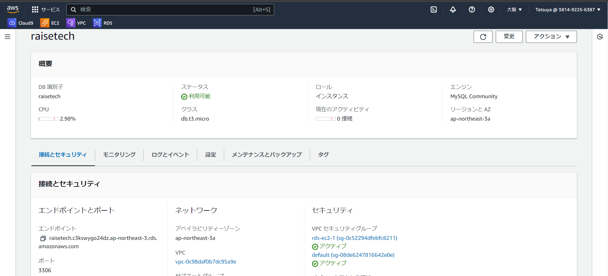
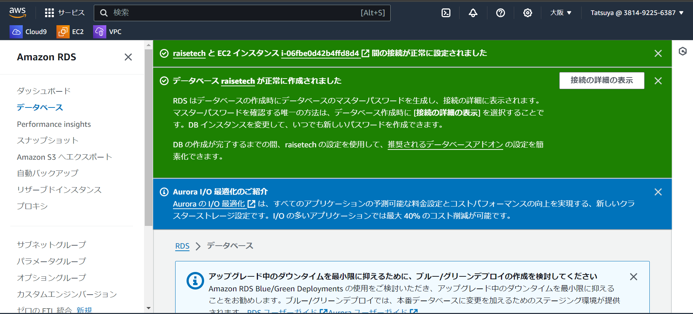
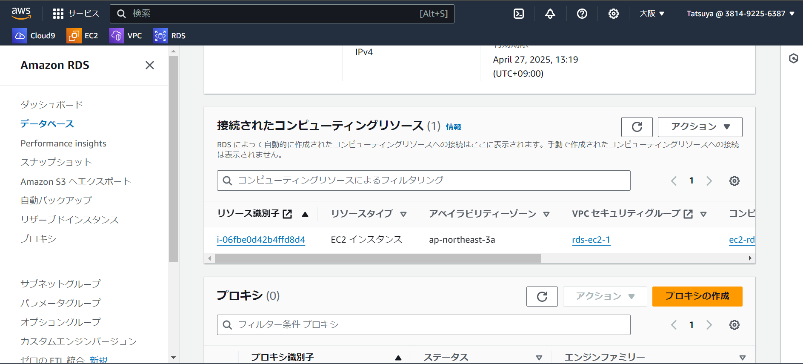

# 第4回課題

### VPCの作成
* CIDRはいじらずにデフォルトで作成しました。

### EC2の作成
* OSはAmazonLinux 2023で、セキュリティグループはdefaultで作成しました。

### RDSの作成
* MySQLを選択、無料利用枠のテンプレートで作成しました。

### EC2からRDSの接続確認
* RDS作成時にEC2コンピューティングリソースに接続から作成したEC2インスタンスを選択し接続しました。

