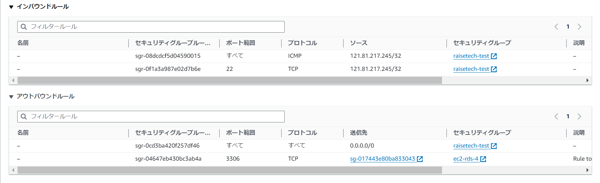

# 第4回課題

### VPCの作成
* 今回は動作確認のため最低限VPCとパブリック・プライベートサブネットとIGWを作成しました。

### EC2の作成
* OSはAmazonLinux2にしました。

* セキュリティグループは動作確認に必要な自分のIPからのSSHとping疎通のためのICMPを許可するよう作成しました。

### RDSの作成
* MySQLを選択、無料利用枠のテンプレートで作成しました。

* VPCは最初に作成したものを選択し、VPCセキュリティグループはEC2からの接続のみを許可するよう設定しました。

### EC2からRDSの接続確認
