# 第5回課題

## サンプルアプリケーションの動作確認

- 組み込みサーバーによる動作確認
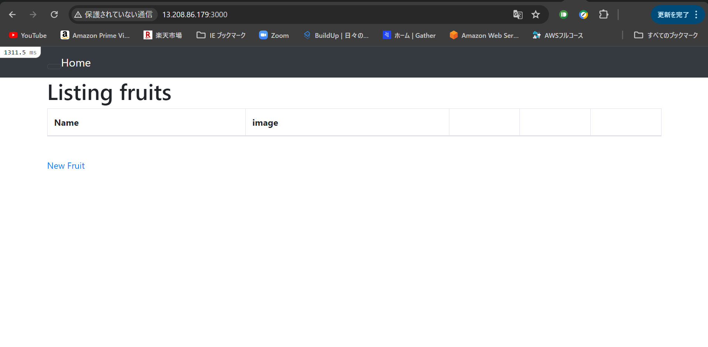

- Unix Socketによる動作確認
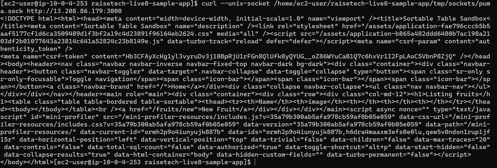

- nginxの単体起動
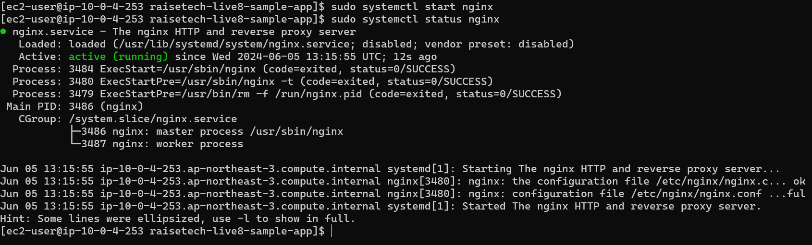

- nginxとpumaを組み合わせての動作確認

## EC2のセキュリティグループ

- インバウンドはSSHとELBからのHTTP接続のみ許可
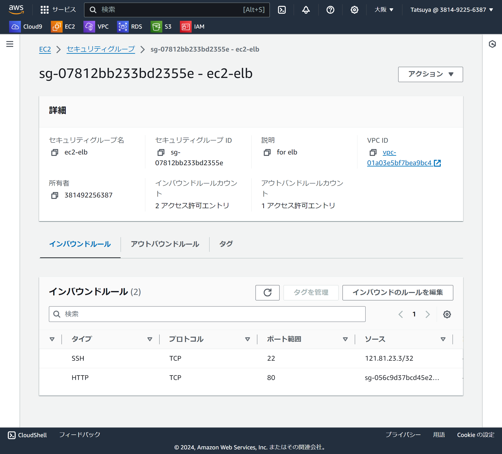

## ALB接続

- ALB作成
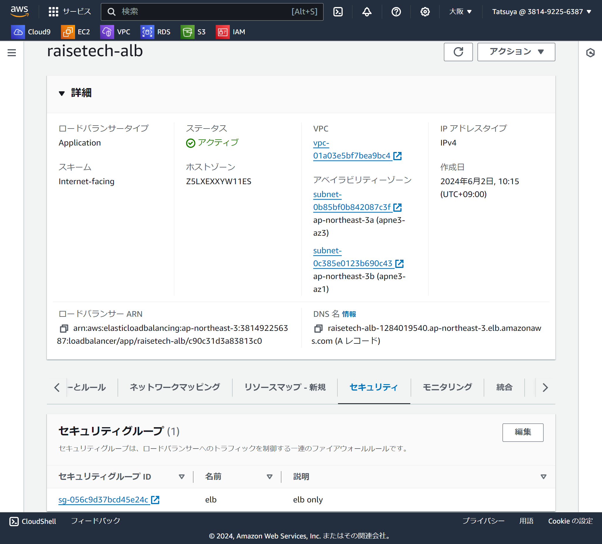

- ALB接続確認
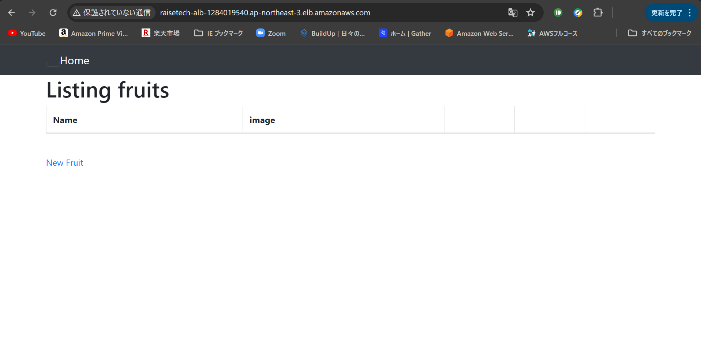

- ELBのセキュリティグループはHTTP接続のみ許可
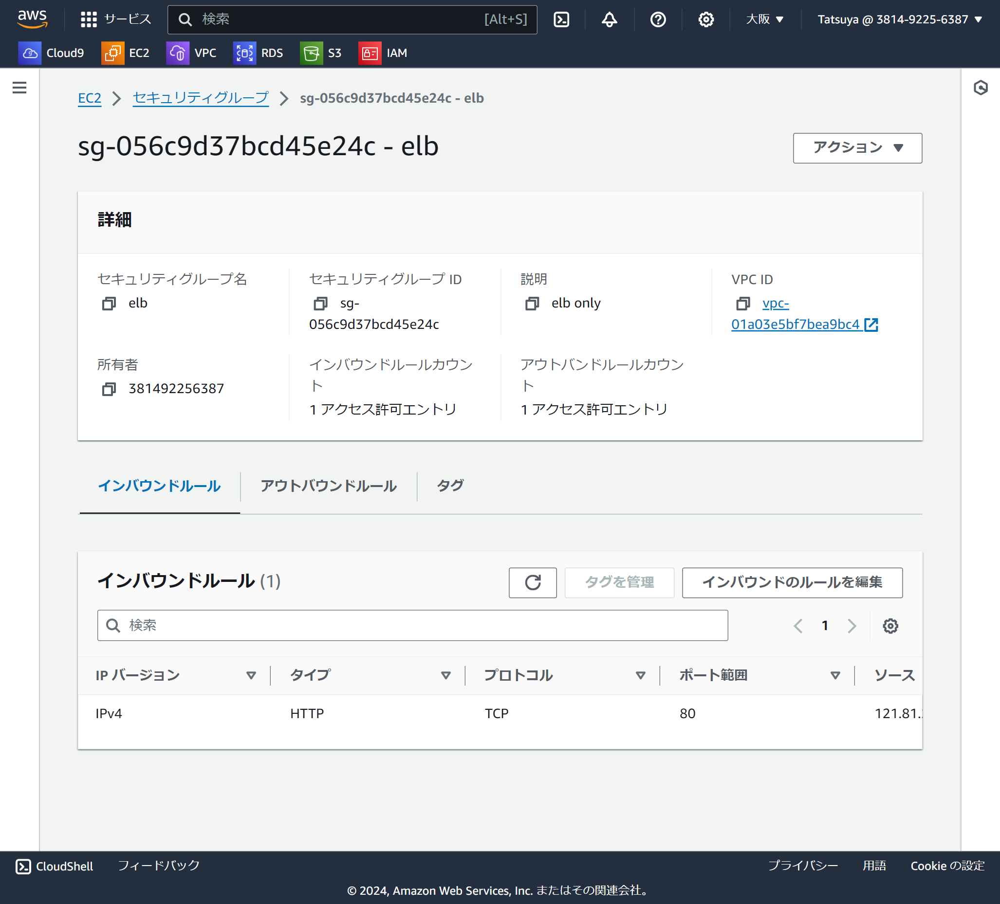

## s3に接続し、画像保存先に設定

- s3バケット作成
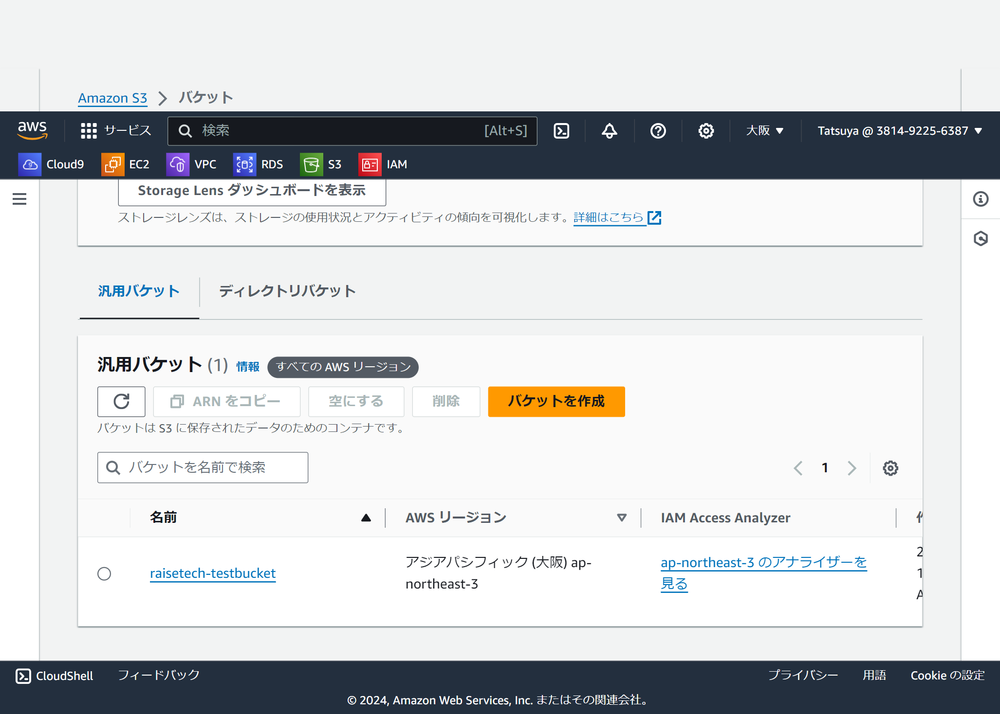

- EC2にs3ロール権限付与
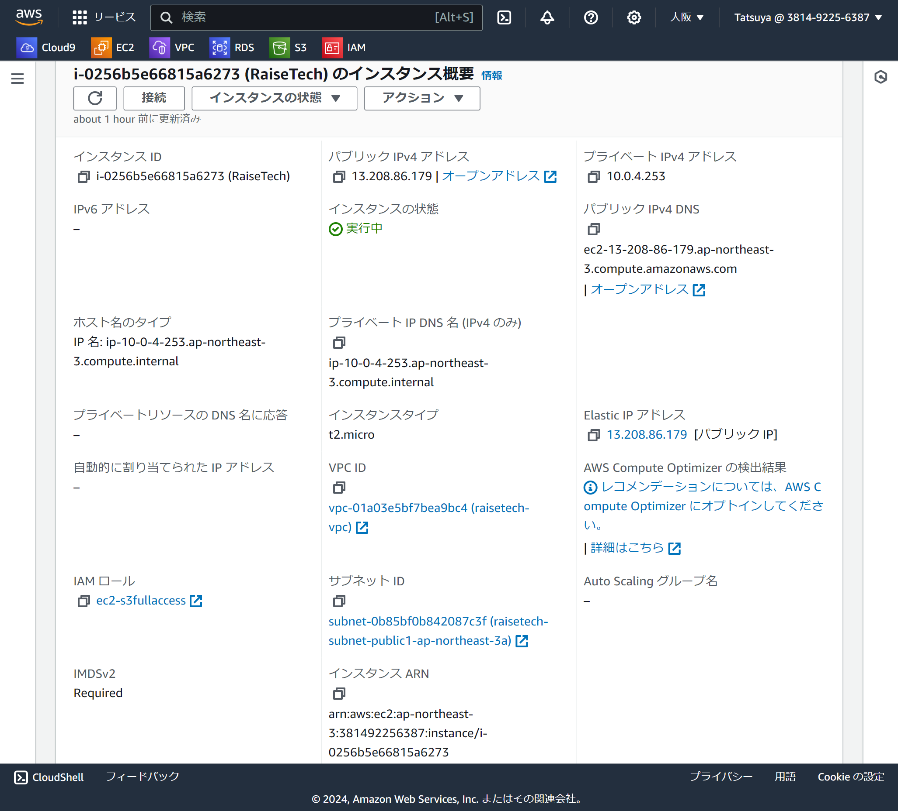

- s3への保存確認
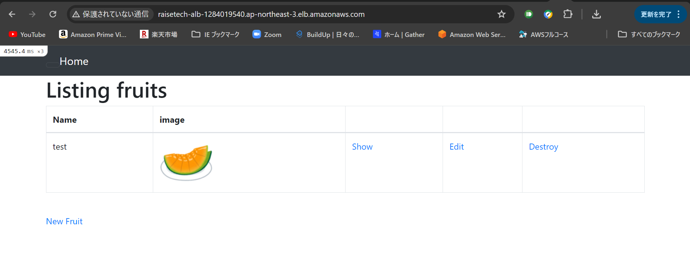

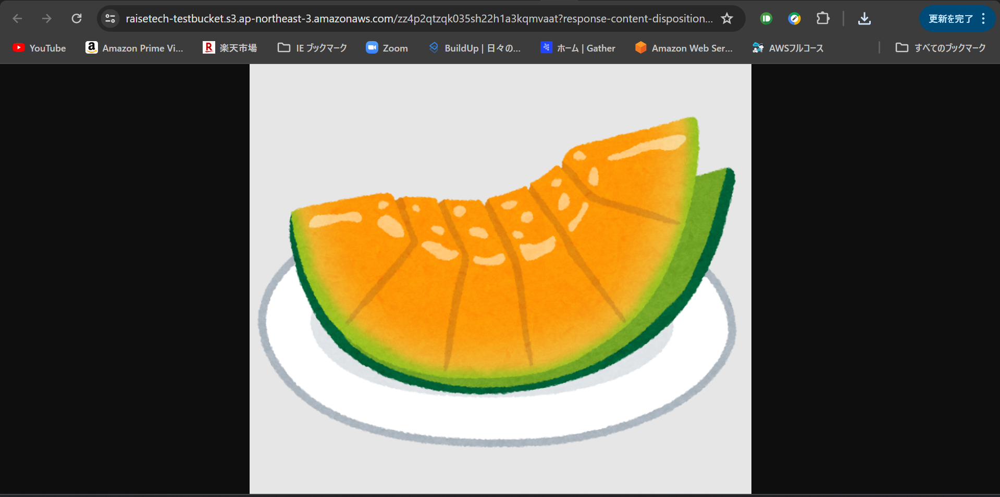

## インフラ構成図
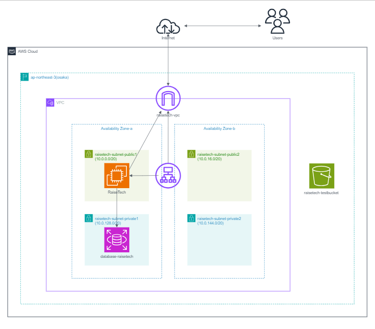 
