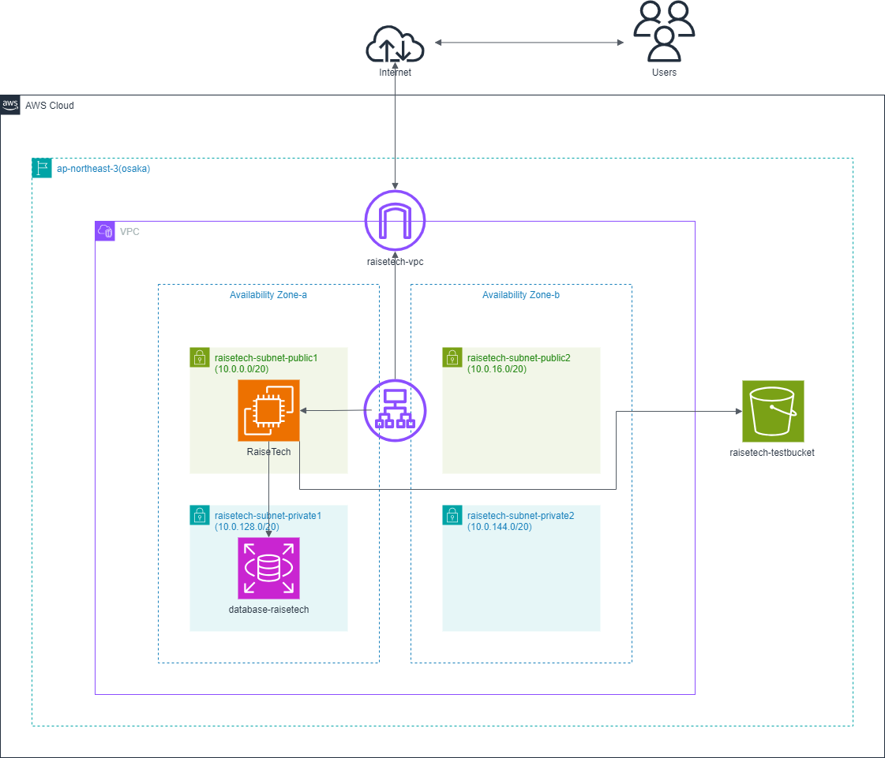

# 第5回課題

## サンプルアプリケーションの動作確認

- 組み込みサーバーによる動作確認

- Unix Socketによる動作確認

- nginxの単体起動

- nginxとpumaを組み合わせての動作確認

## EC2のセキュリティグループ

- インバウンドはSSHとELBからのHTTP接続のみ許可

## ALB接続

- ALB作成

- ALB接続確認

- ELBのセキュリティグループはHTTP接続のみ許可

## s3に接続し、画像保存先に設定

- s3バケット作成

- EC2にs3ロール権限付与

- s3への保存確認

## インフラ構成図
 
