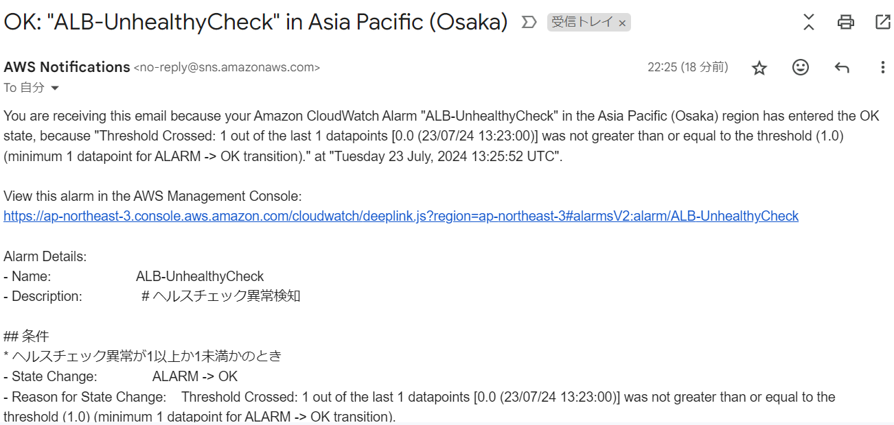

# 第6回課題

## cloudtrailイベント

* イベント名：StartInstances
### 含まれている内容
* イベント時間
* ユーザー名
* イベントソース

## ALB のアラームを設定

* ヘルスチェック異常が１以上のとき

* ヘルスチェック異常が１未満のとき

## 今まで作成したリソースの見積

* URL:https://calculator.aws/#/estimate?sc_channel=cfm-blog&sc_campaign=la-get-cost-estimates-faster-with-aws-pricing-calculator-bulk-import&sc_medium=plan-and-evaluate&sc_content=cfm-blog&sc_detail=link&sc_outcome=ad&sc_publisher=cfm-adoption&trk=la-get-cost-estimates-faster-with-aws-pricing-calculator-bulk-import_cfm-blog_link&id=9a19a0bf316047c3b58b82f19b5afc5cf92482e0

## 現在のEC2の利用料

 
