# 第10回課題

セキュリティグループとそれ以外でスタックを分けております。

## 作成環境

### VPC
VPCにプライベートサブネットとパブリックサブネットを2つずつ作成。
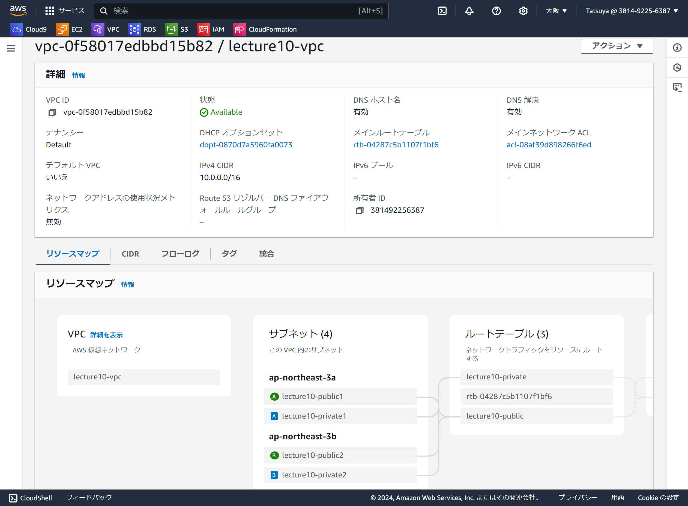

### EC2
- インスタンス
パブリックサブネットに設置し、S3アクセスロール付与
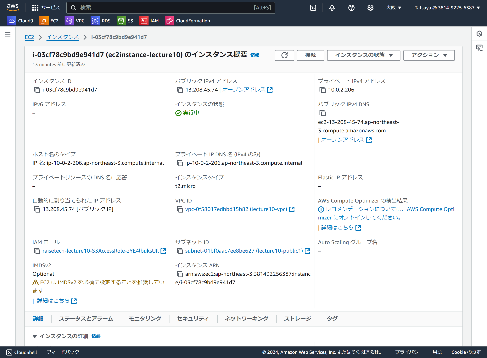
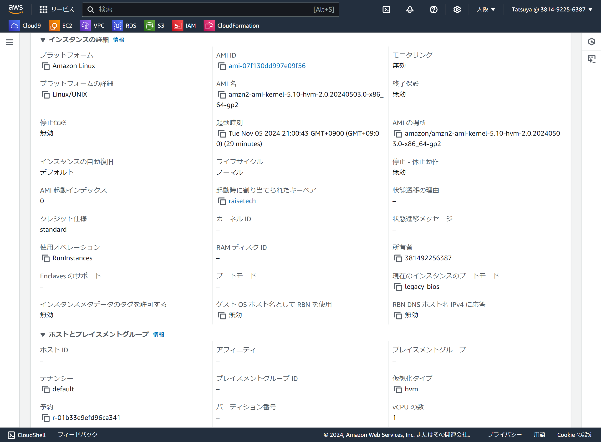

- セキュリティグループ
組み込みサーバーの3000ポートとHTTPをELBのセキュリティグループからの接続のみ許可,SSH,icmpのポートを自分のPCからの接続のみ許可
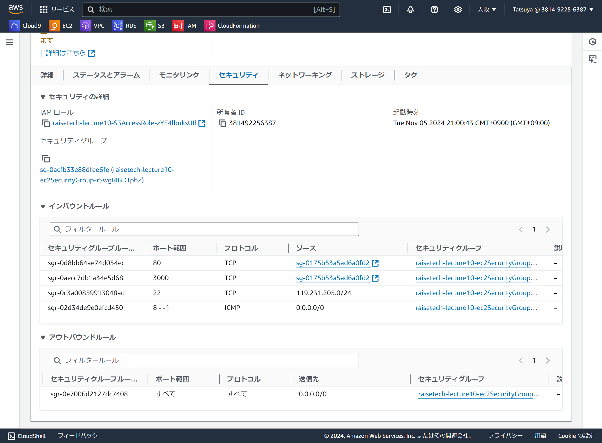

### RDS
- インスタンス
前回環境と同じためデフォルト
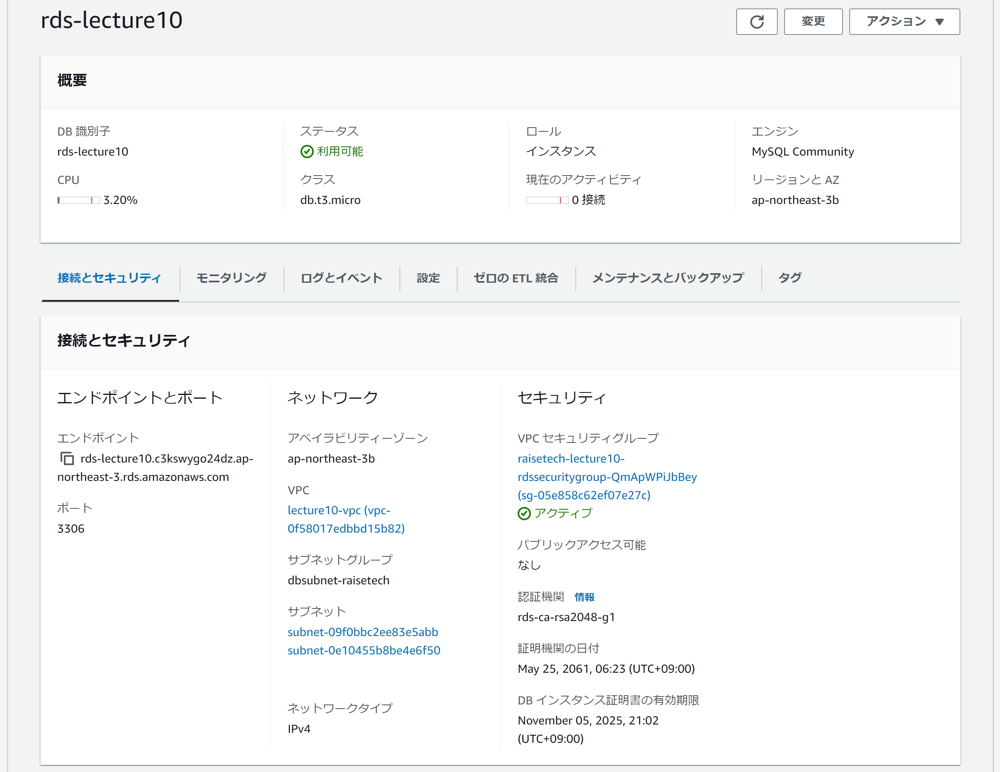

- セキュリティグループ
3306ポートのEC2のセキュリティグループからの接続のみ許可
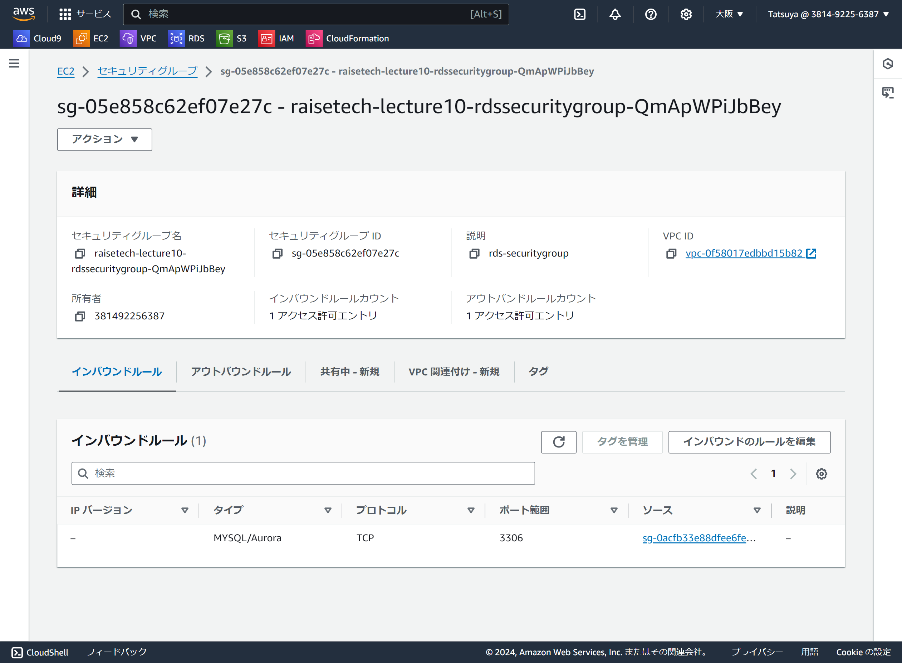

- 接続確認
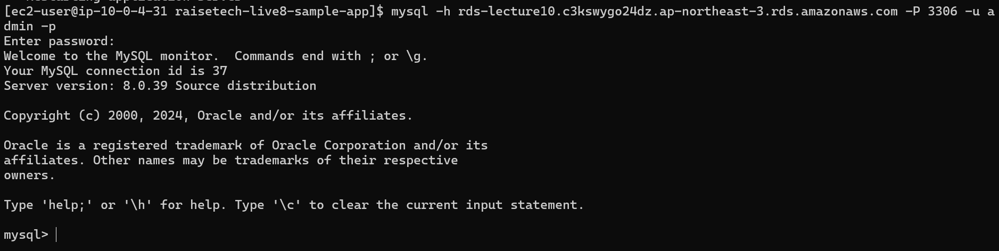

### IAMロール
S3へのアクセス許可をEC2に付与
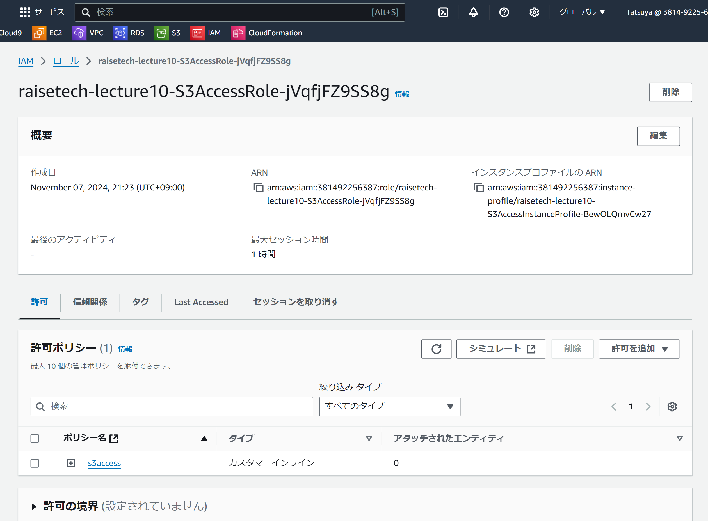

### S3
- バケット
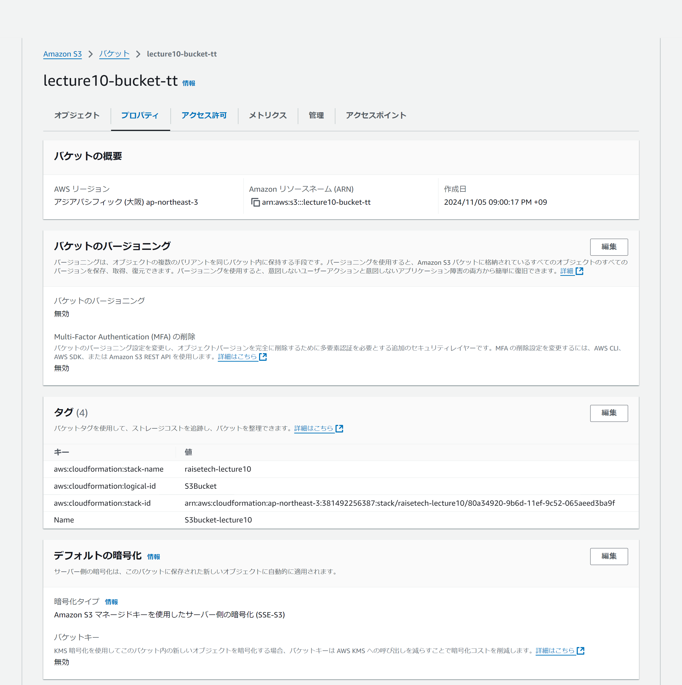

- ポリシー
自分のPCからのアクセスを許可

- 接続確認
S3バケット内の画像をダウンロード
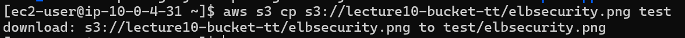

### ELB
- ロードバランサ―
アプリケーションロードバランサ―に設定し、2つのパブリックサブネットに振り分け
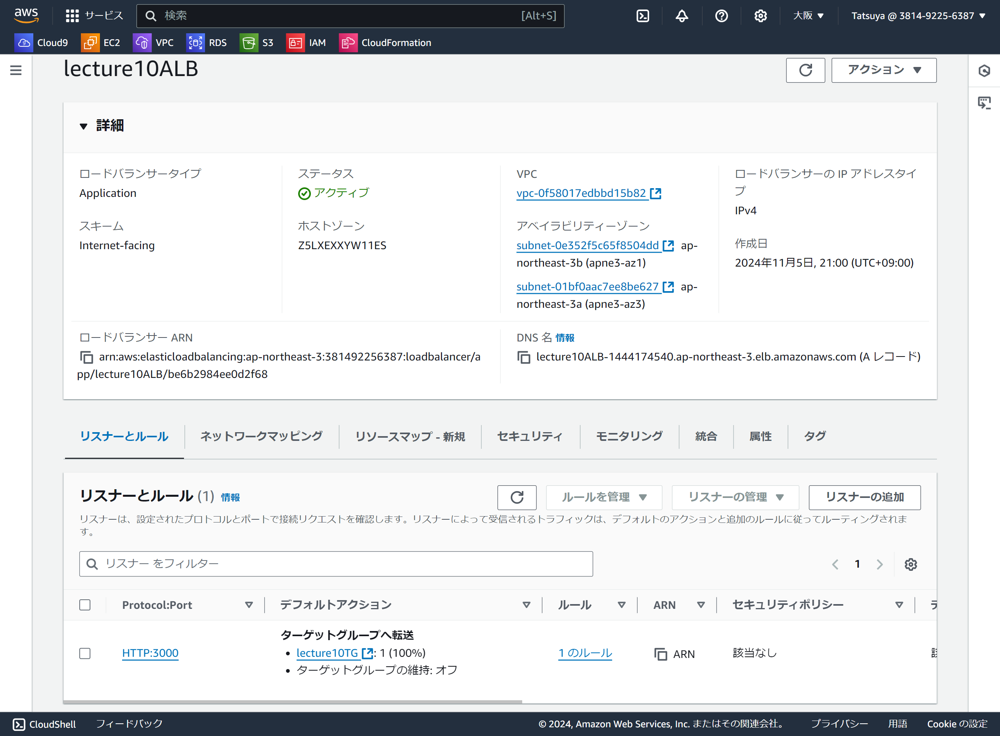

- ターゲットグループ
組み込みサーバーで接続確認したため3000ポートにリッスン設定し、ヘルスチェック正常
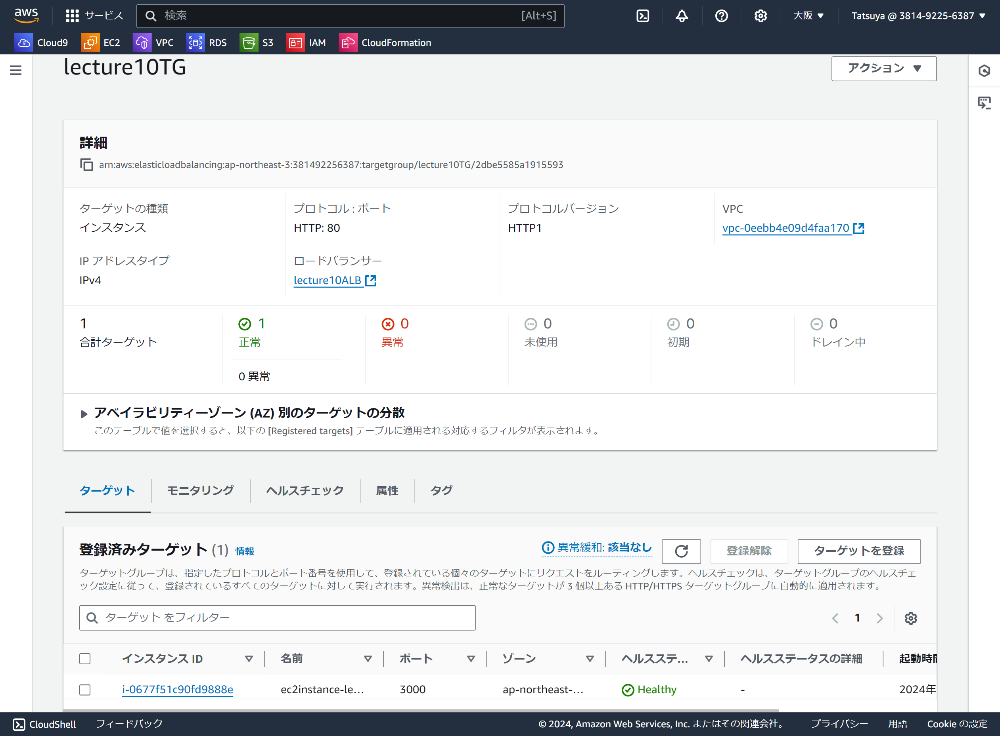

- セキュリティグループ
3000ポートとHTTPのみ許可
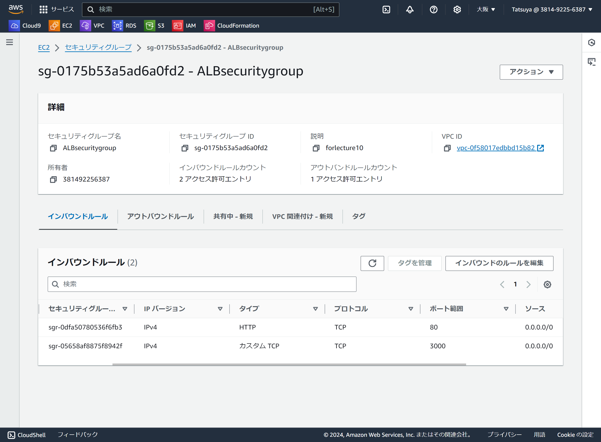

