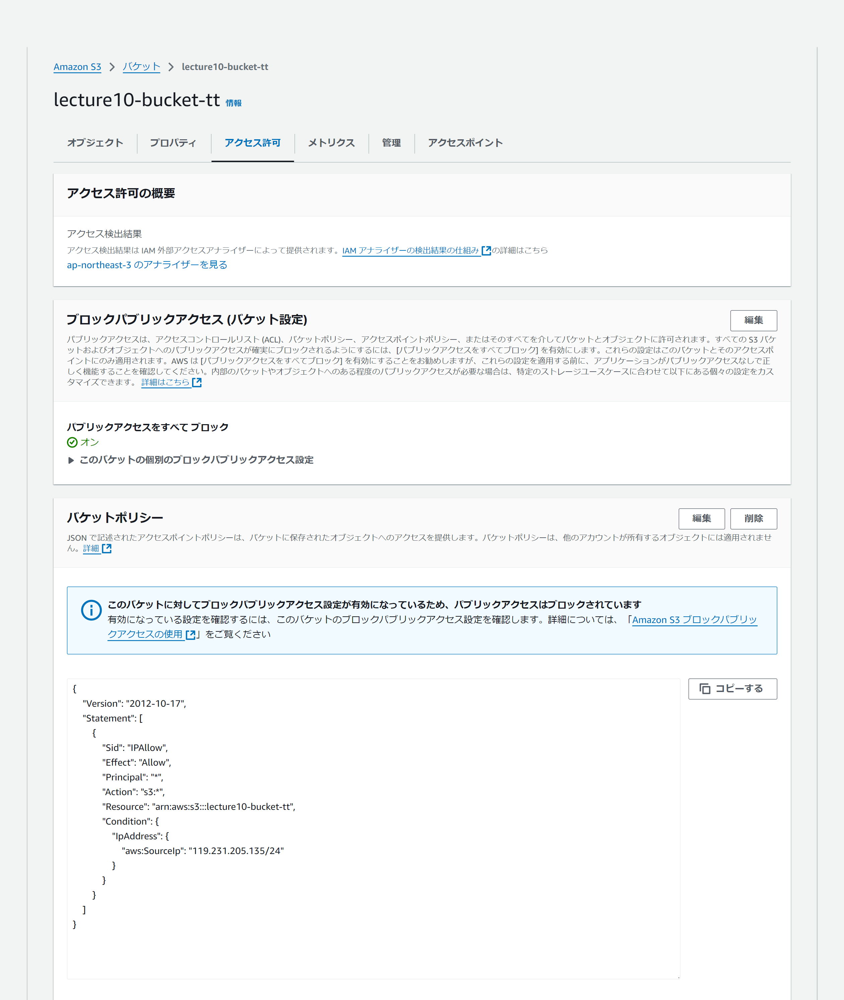

# 第10回課題

セキュリティグループとそれ以外でスタックを分けております。

## 作成環境

### VPC
VPCにプライベートサブネットとパブリックサブネットを2つずつ作成。

### EC2
- インスタンス
パブリックサブネットに設置し、S3アクセスロール付与

- セキュリティグループ
組み込みサーバーの3000ポートとHTTPをELBのセキュリティグループからの接続のみ許可,SSH,icmpのポートを自分のPCからの接続のみ許可

### RDS
- インスタンス
前回環境と同じためデフォルト

- セキュリティグループ
3306ポートのEC2のセキュリティグループからの接続のみ許可

- 接続確認

### IAMロール
S3へのアクセス許可をEC2に付与

### S3
- バケット

- ポリシー
自分のPCからのアクセスを許可

- 接続確認
S3バケット内の画像をダウンロード

### ELB
- ロードバランサ―
アプリケーションロードバランサ―に設定し、2つのパブリックサブネットに振り分け

- ターゲットグループ
組み込みサーバーで接続確認したため3000ポートにリッスン設定し、ヘルスチェック正常

- セキュリティグループ
3000ポートとHTTPのみ許可

