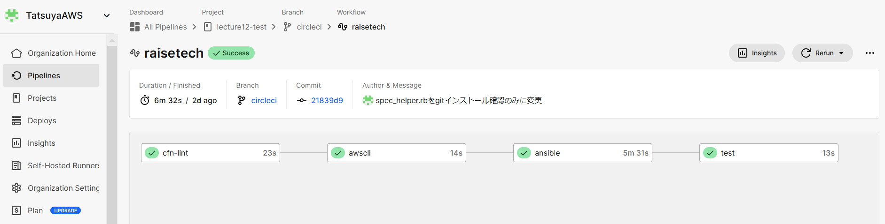

# 第13回課題

## CircleCI のサンプルに ServerSpec や Ansible の処理を追加

- 自動化に使用したリポジトリ
### https://github.com/TatsuyaAWS/lecture12-test/pull/21#issue-2848111581

## 処理内容

- cfn-lintでcfnのテンプレートファイルのチェック

- awscliでEC2を作成するテンプレートファイルをデプロイ

- ansibleでrubyインストール

- testでsereverspecのgitインストールの確認テストを実行

## circleciの処理完了

